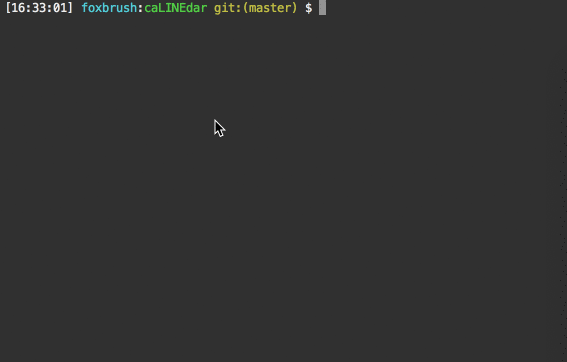

# caLINEdar

## Demo
Load dist/demo/demo.html on the latest Chrome or Firefox

1. Large screen mode


2. Small screen mode


## Features
(development time)
- Let a developer create and mount a date picker onto an assigned element
  - (0.5 days)

- Let a developer get, set, initial the picked date in unix time
  - (0.5 day)

- Let a developer subscribe the picked date change event
  - (0.5 days)

- Let a developer unsubscribe the picked date change event
  - (0.5 days)

- Let a developer able to chose from 3 built-in, Standard, Thai, Iranian, calendars
  - (3 days, including suvey calendars)

- Let a developer able to create own custom calendars to use with
  - (1~2 days, including adjusment for the API design)

- Let a developer able to set the RTL calendar mode
  - (0.5 days)

- Let a visitor able to see the current picked date in local time on the date input field
  - (0.5 days)

- Let a visitor open the calendar when clicking on the date input field
  - (0.5 days)

- Let a visitor close the calendat while clicking out the calendar and the input field
  - (0.5 days)

- Let a visitor pick a date from the calendar
  - (1 days)

- Let a visitor browse through years in the calendar
  - (1 days)

- Let a visitor browse through months in the calendar
  - (1 days)

- Let a visitor able to clear the date picked
  - (0.5 days)

- Auto-adopt the canlendar to devices' screen sizes, such as, a mobile small screen.
  - (0.5 days)

## How to use

### Quick setup
```js
import caLINEdar from "../src/index";

// In your script somewhere
caLINEdar.init(window);
let dateInputMountElem = document.querySelector("#date-input-mounting-elem");
let dateInput = caLINEdar.createDateInput({
  date: new Date(),
  mountElem: dateInputMountElem,
  onChange: dateInput => console.log("Changed", dateInput.getDate())
});
```
And that is! You are done. Our caLINEdar will manage calendar for you.

### Custom calendars
Our caLINEdar provide a default standard calendar, which should fit into most areas in the world.
However, still different areas may use differernt calendars.
The caLINEdar also provides another 2 calendars: Thai calendar in Buddhist year and Iranian calendar.
For example, to use the Thai calendar:
```js
import caLINEdar from "../src/index";
import createThaiCalender from "../src/ThaiCalender";

caLINEdar.init(window);
let dateInputMountElem = document.querySelector("#date-input-mounting-elem");
let thaiCalendar = createThaiCalender(caLINEdar);
let dateInput = caLINEdar.createDateInput({
  date: new Date(),
  calendar: thaiCalendar,
  mountElem: dateInputMountElem,
  onChange: dateInput => console.log("Changed", dateInput.getDate())
});
```
OK, you are done! Now your calendar is a Thai calendar in Buddhist year.
For the Irainian calendar, please use IranSolarHijriCalender.js.
With this design you can just import what you need for your app.

#### What if you need your own custom calendar?
The caLINEdar communicates with calendars through the `CaLINEdarCalender` class.
So just extend that class and build your own calendar. See the API Design part below for more.

## API Design
### caLINEdar
```js
/**
 * This is our main API object for the caLINEdar date picker lib.
 * It helps to create the date input field and provide some helper methods.
 *
 * The whole API artchitecture goes as below
 *
 *          ----------
 *         |  Users   |
 *          ----------
 * Control    |    ^  Notify
 * with APIs  |    |  with events
 *            |    |
 *            V    |        Get dates from 
 *    --------------------  with APIs     --------------------
 *   | CaLINEdarDateInput | -----------> |  CaLINEdarCalender |
 *    --------------------                --------------------
 * Control    |    ^  Notify                    | Borrow helper methods
 * with APIs  |    |  with events               | from 
 *            |    |                            |
 *            V    |                            |
 *         -----------                          |
 *        | caLINEdar | <------------------------
 *         -----------    
 */
const caLINEdar = {
  /** Public APIs **/

  /**
   * See `CaLINEdarCalender`
   */
  CaLINEdarCalender,

  /**
   * See `CaLINEdarDateInput`
   */
  CaLINEdarDateInput,

  /**
   * The class of the standard calnedar
   */
  StandardCalendar,

  /**
   * Must call `init` before any operations
   * 
   * @param win {Window} The Window object
   */
  init(win)

  /**
   * @param params {Object} the parameters to create a `CaLINEdarDateInput`, including
   *    - mountElem {HTMLElement} The element where the input element sits. 
   *                              One input element will be created for you so don't pass another one.
   *
   *    - calendar {*} If not given, will use the standard calendar. See `CaLINEdarDateInput` for more.
   *    - rtl {*} See `CaLINEdarDateInput`.
   *    - date {*} See `CaLINEdarDateInput`.
   *    - event types {*} See `CaLINEdarDateInput`.
   *
   * @return {CaLINEdarDateInput} An instance of `CaLINEdarDateInput`. `null` if failed.
   */
  createDateInput(params)

  /**
   * This set one current associated dateInput.
   *
   * @param dateInput {CaLINEdarDateInput} the `dateInput` to set as the current one
   */
  setCurrentDateInput(dateInput)

  /**
   * @return {CaLINEdarDateInput} The current date input associated. `null` if none.
   */
  getCurrentDateInput()

  /**
   * @return {bool} `true` if the calendar is open.
   */
  isCalendarOpen()

  /**
   * Open the calendar. Always open the date picker first.
   *
   * @param anchorInput {HTMLInputElement} the input at which the calendar is anchor
   * @param params {*} See `showDatePicker`
   *
   * @return {Promise} A promise
   */
  async openCalendar(anchorInput, params)

  /**
   * Close the calendar
   */
  closeCalendar()

  /**
   * Must always call `openCalendar` first to have the calendar opened.
   *
   * @param params {Object} The parameters are:
   *    - value {String} The data attribute value identifing year and month
   *
   *    - rtl {bool} Optional. `true` for the RTL mode. Default is `false`
   *
   *    - pickerBtns {Array} represent the buttons on the top of the picker.
   *                         Each button should contains
   *                         - text {String} the button title
   *                         - value {String} the data attribute value for this button,
   *                           which will be used to identify this button when clicking.
   *
   *    - weekHeaders {Array} The titles of days in a week (count is 7).
   *                          The 1st one is displayed in the left-most.
   *
   *    - dates {Array} 
   *        An array (count is `MAX_COUNT_DATES_IN_DATE_PICKER`) of dates to display.
   *        Each date is an object with:
   *        - text {String} The title of this date
   *        - value {Integer} The data attribute value identifying this date
   *        - picked {bool} whether this date is picked
   *        - special {bool} whether this date should be highlighted as special
   *        - grayOut {bool} whether this date should be gray out (Win over `special`)
   *
   *    - noMoreLeft {bool} Optional. `true` means can't flip the year picker
   *                        leftward any more so hide the left button. Default is `false`
   *
   *    - noMoreRight {bool} Optional. `true` means can't flip the year picker
   *                         rightward any more so hide the right button. Default is `false`
   */
  showDatePicker(params)

  /**
   * Close the data picker
   */
  closeDatePicker()

  /**
   * @param params {Object} The parameters are:
   *    - value {String} The data attribute value identifing year
   *
   *    - rtl {bool} Optional. `true` for the RTL mode. Default is `false`
   *
   *    - pickerBtns {Array} represent the buttons on the top of the picker.
   *                         Each button should contains
   *                         - text {String} the button title
   *                         - value {String} the data attribute value for this button,
   *                           which will be used to identify this button when clicking.
   *
   *    - months {Array} 
   *        An array (count is `MAX_COUNT_MONTHS_IN_MONTH_PICKER`) of months to display.
   *        Each month is an object with:
   *        - text {String} The title of this month
   *        - value {Integer} The data attribute value identifying this month
   *        - picked {bool} whether this month is picked
   *
   *    - noMoreLeft {bool} Optional. `true` means can't flip the year picker
   *                        leftward any more so hide the left button. Default is `false`
   *
   *    - noMoreRight {bool} Optional. `true` means can't flip the year picker
   *                         rightward any more so hide the right button. Default is `false`
   */
  showMonthPicker(params)

  /**
   * Close the month picker
   */
  closeMonthPicker() {
    if (this._monthPicker) {
      this._monthPicker.style.display = "none";
      this._monthPicker.removeAttribute("data-caLINEdar-value");
    }
  },

  /**
   * @param params {Object} The parameters are:
   *    - value {String} The data attribute value identifing year
   *
   *    - rtl {bool} Optional. `true` for the RTL mode. Default is `false`
   *
   *    - months {Array} 
   *        An array (count is `MAX_COUNT_YEAR_IN_YEAR_PICKER`) of years to display.
   *        Each year is an object with:
   *        - text {String} The title of this year
   *        - value {Integer} The data attribute value identifying this year
   *        - picked {bool} whether this year is picked
   *
   *    - noMoreLeft {bool} Optional. `true` means can't flip the year picker
   *                        leftward any more so hide the left button. Default is `false`
   *
   *    - noMoreRight {bool} Optional. `true` means can't flip the year picker
   *                         rightward any more so hide the right button. Default is `false`
   */
  showYearPicker(params)

  /**
   * Close the year picker
   */
  closeYearPicker()

  /**
   * @return {Date} A JS Date object meaning right now in the local time
   */
  getNowInLocalTimezone()

  /**
   * @param v {*} The value to test
   * @return {bool} `true` if the given `v` beloings to Integer or `false`
   */
  isInt(v) {
    if (Number.isInteger) {
      return Number.isInteger(v);
    }
    // OK We are seeing IE!?
    if (isNaN(v)) {
      return false;
    }
    let x = parseFloat(v);
    return (x | 0) === x;
  }

  /**
   * @return {bool} `true` if the current is a small window's screen.
   */
  isSmallScreen()
}
```

### CaLINEdarDateInput
```js
/**
 * This class controls the date input field element and provides lib users APIs
 * to set, get, listen to date etc.
 */
class CaLINEdarDateInput {
  /* Public APIs */

  /**
   * @param params {Object}
   *    The params provided by users
   *    - calendar {CaLINEdarCalender} The calendar extends `CaLINEdarCalender` so we can get dates to pick
   *    - rtl {bool} Optional. `true` for the RTL mode. Default is `false`
   *    - date {*} Optional. See `setDate`
   *    - event types {Function} Optional. The events to subscribe. See `subscribe` for events.
   *
   *    The params provided by our caLINEdar lib.
   *    Usually a user doesn't have to provide these for the daily usage
   *    if create a CaLINEdarDateInput instance through the `caLINEdar` object.
   *    Having these is for the case if we want to do testing in the future.
   *    - caLINEdar {Object} the caLINEdar object
   *    - input {HTMLInputElement} one input element
   *    - window {Window} the global Window instance
   */
  constructor(params)

  /**
   * @return {Date} The currently picked date in the unix time. `null` if none is picked.
   */
  getDate()

  /**
   * Set the date picked
   *
   * @param date {Date|Integer} 
   *    A unix time or js date based on the unix time.
   *    The definition of a unix time: https://en.wikipedia.org/wiki/Unix_time
   *
   * @return {bool} `true` if set or `false`
   */
  setDate(date)

  /**
   * Clear the date picked
   */
  clearDate() {
    this._unixDate =
    this._localDate = null;
    this.input.value = this._calendar.getDateStringPlaceholder();
  }

  /**
   * Open the calendar to let user pick a date
   */
  openCalendar()

  /**
   * Close the calendar
   */
  closeCalendar()

  /**
   * Subscribe a event. The Valid events are:
   * - onChange: Called when the date picked is changed
   *
   * @param eventType {Stirng} The event type
   * @param handler {Functoin}
   *    The event handler. 
   *    When invoked, this CaLINEdarDateInput instance will be pass in.
   */
  subscribe(eventType, handler)


  /**
   * Unsubscribe a event
   *
   * @param eventType {Stirng} The event type
   * @param handler {Functoin} The event handler to unsubscribe
   */
  unsubscribe(eventType, handler)
}
```

### CaLINEdarCalender
```js
/**
 * This abstract class reprensents a calendar providing dates to display.
 * You can extend this class to create your own local calendar.
 * This makes our caLINEdar display not only built-in calendar but also custom calendars.
 * Here you will hear 2 terms *js date* and *local date*. Each means:
 * - JS date simply means a date based on JS date mechanism.
 * - Local date simply means a date this clendar provides
 * Say, in a Thai calendar, a local date is 2559/10/17 and its js date is 2016/10/17
 */
class CaLINEdarCalender {

  /**
   * Check a date in the calendar or not.
   * Notice: since it checks against the calendar,
   * the given year, month, date should based on the calendar's *local* time.
   *
   * @param year {Integer} the year value per this calendar
   * @param month {Integer} Optional. the month value per this calendar
   * @param date {Integer} Optional. the date value per this calendar
   *                       Only useful when `month` is given too.
   * 
   * @return {bool} `true` date in the calendar or `false`
   */
  isDateInCalendar(year, month, date)
  /**
   * @return {String}
   *    The date string placeholder to let outside use as placeholder in,
   *    say, a input element. For exmpale, `"YYYY/MM/DD"`
   */
  getDateStringPlaceholder()

  /**
   * @param year {integer} Optional. the year value per this calendar
   * @param month {Integer} Optional. the month value per this calendar
   * @param date {Integer} Optional. the date value per this calendar
   *
   * @return {Array} 
   *    For example There is a JS Date-based calendar and a date as `new Date(2018, 3, 9)`.
   *    Calling `getDateStringFormat(2018, 3, 9)` would return an object as
   *    
   *    {
   *      year: {
   *        pos: 2,
   *        text: "2018"
   *      },
   *      month: {
   *        pos: 0,
   *        text: "Apr"
   *      },
   *      date: {
   *        pos: 1,
   *        text: "09"
   *      },
   *      delimiter: "/"
   *    }
   *    
   *    which means this calendar prefers a date string format as "Apr/10/2018".
   *    If unable to format, `null`.
   */
  getDateStringFormat(year, month, date)

  /**
   * @param jsDate {Date} a JS Date object
   *
   * @return {String}
   *    The date string formated into this calendar's locale.
   *    `""` if unable to format one.
   */
  toLocaleDateString(jsDate)

  /**
   * Get today's date values per this calendar
   *
   * @params options {Object} Optional. Options are:
   *    - fallback {String} "1st-date" | "last-date"
   *
   * @return {Object} 
   *    An object with
   *    - year {integer} the today's year value per this calendar
   *    - month {integer} the today's month value per this calendar
   *    - date {integer} the today's date value per this calendar
   *    But if unable to get one (Maybe some custom calendar has really a limited date range),
   *    `null` returned if no `fallback` option
   *    The 1st/last date in this calendar if `fallback` option given
   */
  getNow(options)

  /**
   * @param year {Integer} Optional. Passed if needed a year to determin months
   *
   * @return {Array}
   *    One array of objects representing months.
   *    The 1st one is the 1st month. Each month object is as below:
   *    - text {String} The title of this month
   *    - value {Integer} The unique value representing this month
   */
  getMonths(year)

  /**
   * @params {Array}
   *    One array of objects representing a day in a week.
   *    The 1st one is the 1st day. Each day object is as below:
   *    - text {String} The title of this day
   *    - value {Integer} The unique value representing this day
   */
  getDays()

  /**
   * @param year {Integer} the year value per this calendar
   * @param month {Integer} the month value per this calendar
   *
   * @return dates {Array}
   *    An array of dates per this calendar in the given year and month.
   *    Each date is an object with:
   *    - year {Integer} The unique year value
   *    - month {Integer} The unique month value
   *    - date {Integer} The unique date value
   *    - day {Integer} The unique day value
   *    - holiday {bool} whether this date is a holiday or not
   *    Or `null` if unable to get for the given year and month
   */
  getDates(year, month)

  /**
   * @param year {Integer} the year value per this calendar
   * @param month {Integer} the month value per this calendar
   * @param date {Integer} the date value per this calendar
   *
   * @return {Object} An object with
   *                  - year {integer} the year value per JS Date
   *                  - month {integer} the month value per JS Date
   *                  - date {integer} the date value per JS Date
   *                  Or `null` if unable to convert
   */
  convertLocalDate2JSDate(year, month, date)

  /**
   * @param year {Integer} the year value per JS Date
   * @param month {Integer} the month value per JS Date
   * @param date {Integer} the date value per JS Date
   *
   * @return {Object} An object with
   *                  - year {integer} the year value per this calendar
   *                  - month {integer} the month value per this calendar
   *                  - date {integer} the date value per this calendar
   *                  Or `null` if unable to convert
   */
  convertJSDate2LocalDate(year, month, date)
}
```

## How to run
1. Install nodejs(7+) and yarn(optional).

2. Navigate into the repo directory.

3. Run `npm install` or `yarn install`(if prefer and installed yarn).

4. Run `npm run build-dev` or `yarn build-dev`(if prefer and installed yarn).
   - The watch-mode will be enabled during your editing

   - In case of any issue. Here is this project's environment for reference:
     - MAC OS 10.12.6
     - node v9.4.0
     - yarn 1.3.2
     - npm 5.6.0

## How to test
1. Install nodejs(7+) and yarn(optional).

2. Navigate into the repo directory.

3. Run `npm install` or `yarn install`(if prefer and installed yarn).

4. Run `npm run test` or `yarn test`(if prefer and installed yarn).
   - The test is based Jest: https://facebook.github.io/jest/

5. In case you aren't able to test. Here is this project's environment for reference:
     - MAC OS 10.12.6
     - node v9.4.0
     - yarn 1.3.2
     - npm 5.6.0



